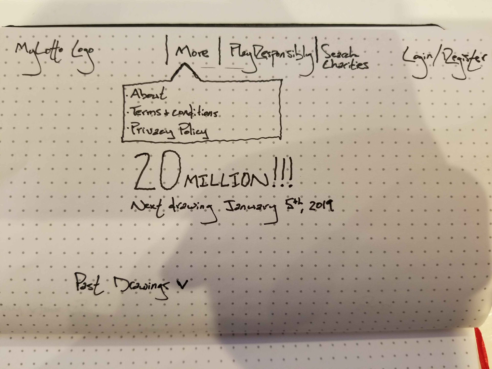
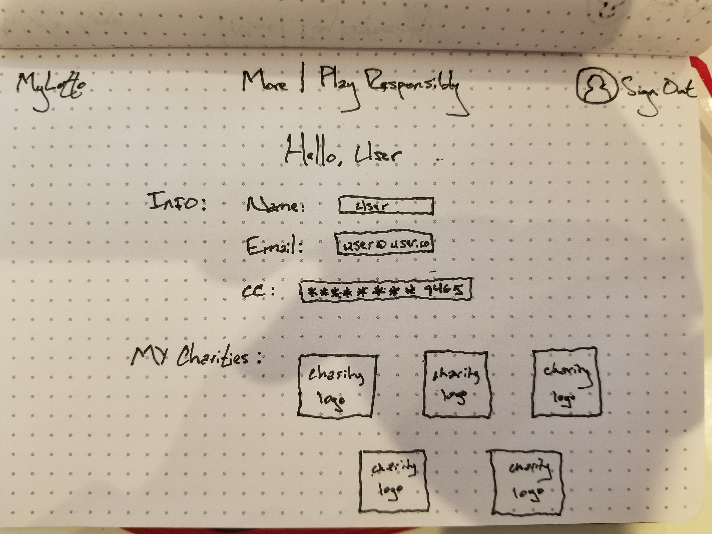

## Project4 - MyLotto
## INTRO:
- MyLotto is a 2 dollar lottery that donates the majority of the player's money to charity.

## TECHNOLOGIES:
- I will use React on the front end and Ruby on the backend

## USER STORIES:
- For those who don't play the lottery because they don't like feeling like they are wasting their money, or for those who play and still feel the same way. Players have a chance to win and help someone along the way.

## M.V.P:
- User will be able to view a guest page and, once logged in, a member page
- Difference between two views is the ability to buy a ticket and donate
- User will be able to search through a list of charities and add a charity to their list
- Site will have a home page, similar to other lottery sites, including information about us as well as current and past drawings
- Site will have a search charity feature
- Site will also have a user profile, that may include an "amount donated" feature

## POST M.V.P:
- CC verification
- Winners list
- Charity of the week
- Perhaps branch out to school systems, camps, etc.

## WIREFRAMES

