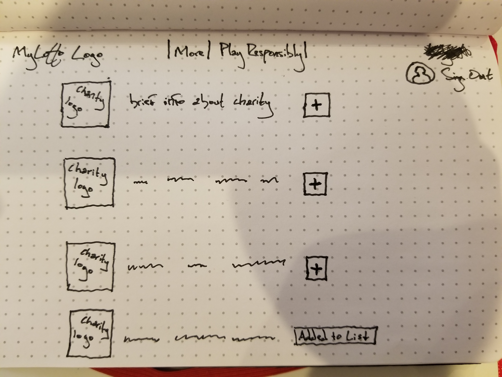

## Project4 - MyLotto

## Intro:
- MyLotto is a 2 dollar lottery that donates the majority of the player's money to charity.

## Technologies:
- I will use React on the front end and Ruby on the backend
- I applied for an API key with the "Charity Navigator API" (linked below)
  - https://charity.3scale.net/admin/applications/1409618154227

## User Stories:
- For those who don't play the lottery because they don't like feeling like they are wasting their money, or for those who play and still feel the same way. Players have a chance to win and help someone along the way.

## M.V.P:
- User will be able to view a guest page and, once logged in, a member page
- Users will be able to search through a list of charities, and logged in users will be able to add a charity to their list
- Site will have a home page, similar to other lottery sites, it would ideally include the current jackpot, information about the lottery, past drawings and the most recent drawing, and a "buy ticket" section
- Site will have a search charity feature
- Site will also have a user profile, that will include a list of their charities, also may include an "amount donated" feature

## Post M.V.P:
- Have a functioning database of drawings and past drawings
- CC verification
- Winners list
- Charity of the week
- Perhaps branch out to school systems, camps, etc.

## WireFrames

